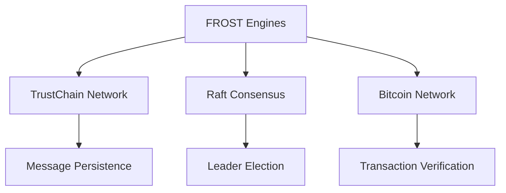
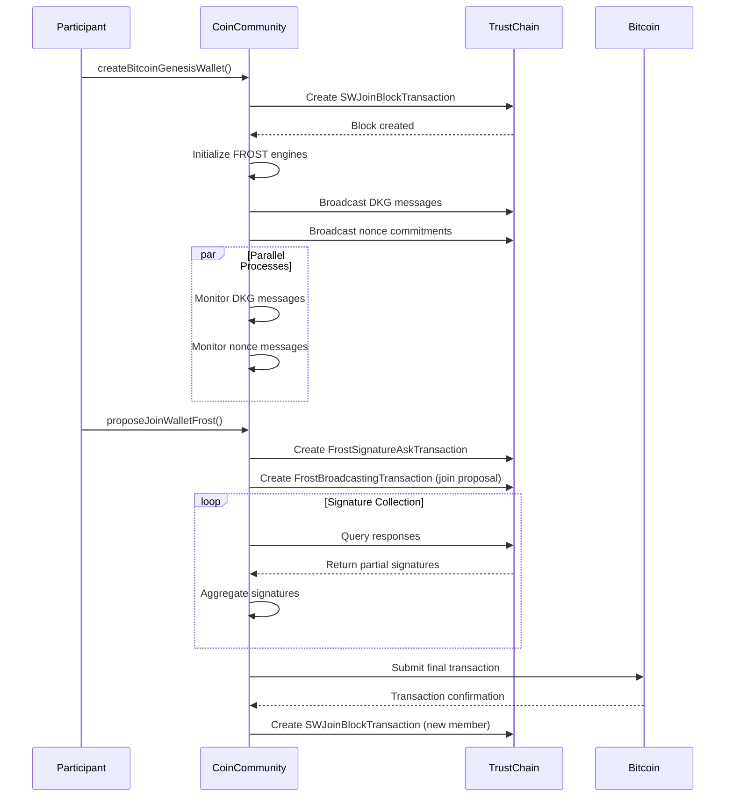
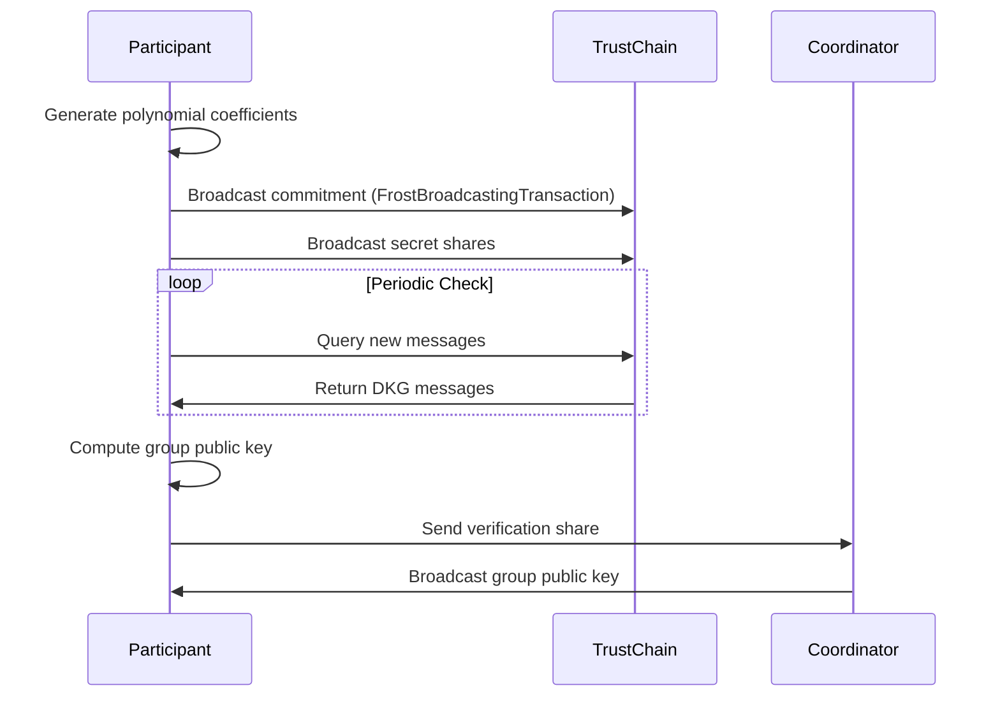
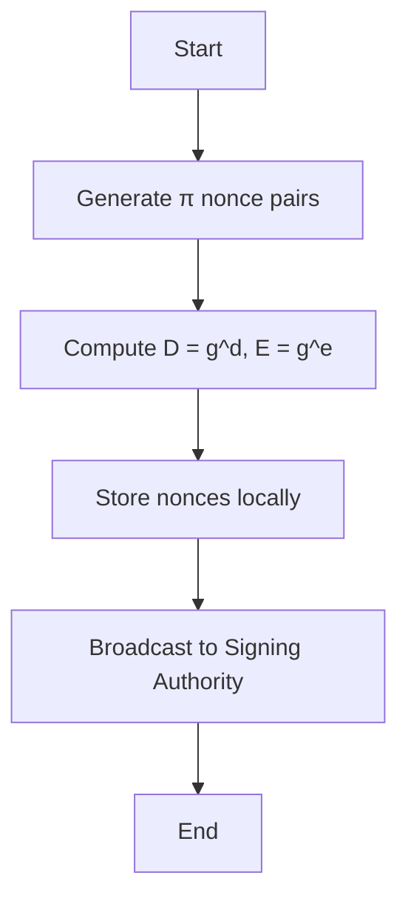
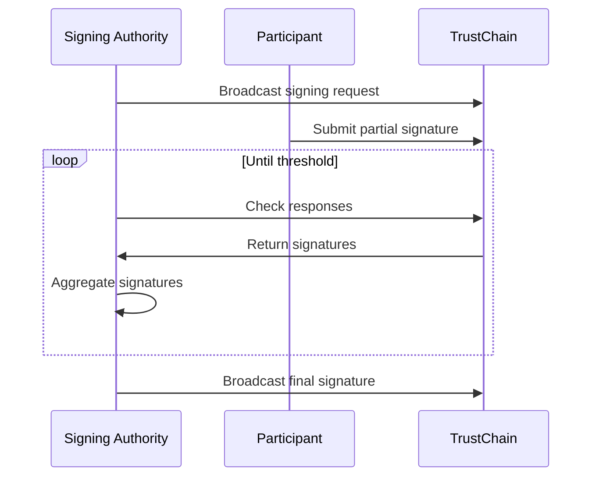
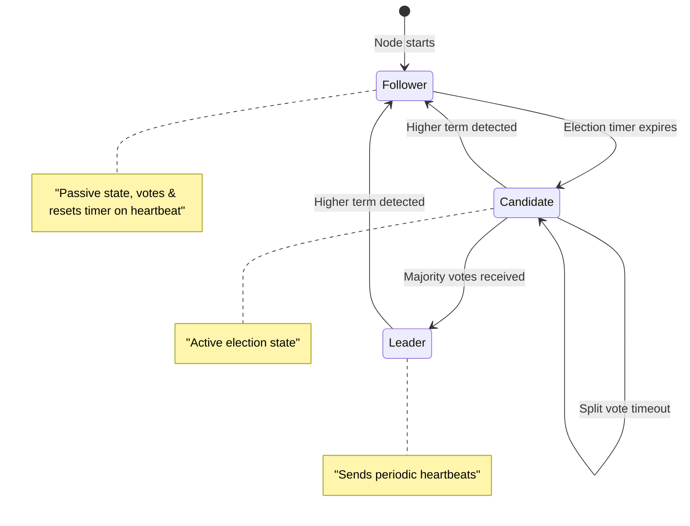
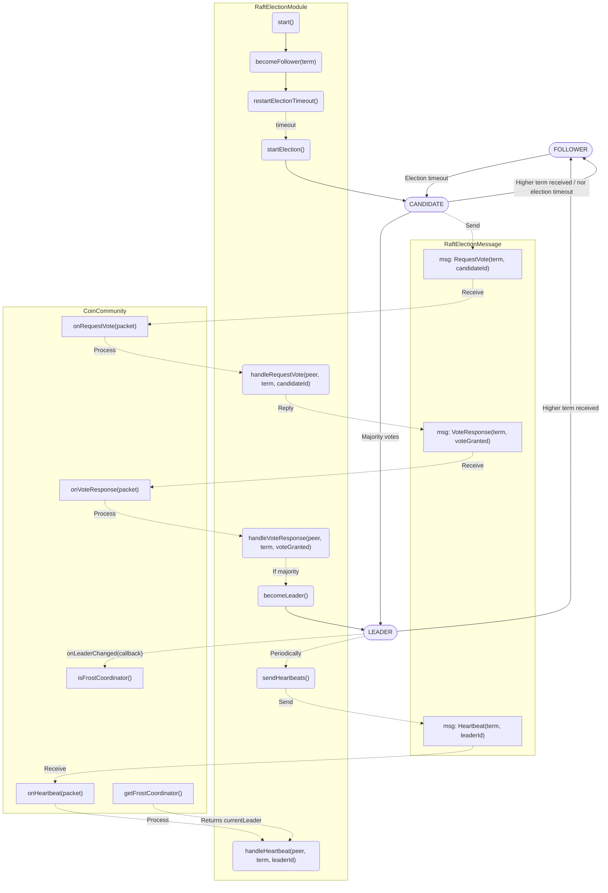
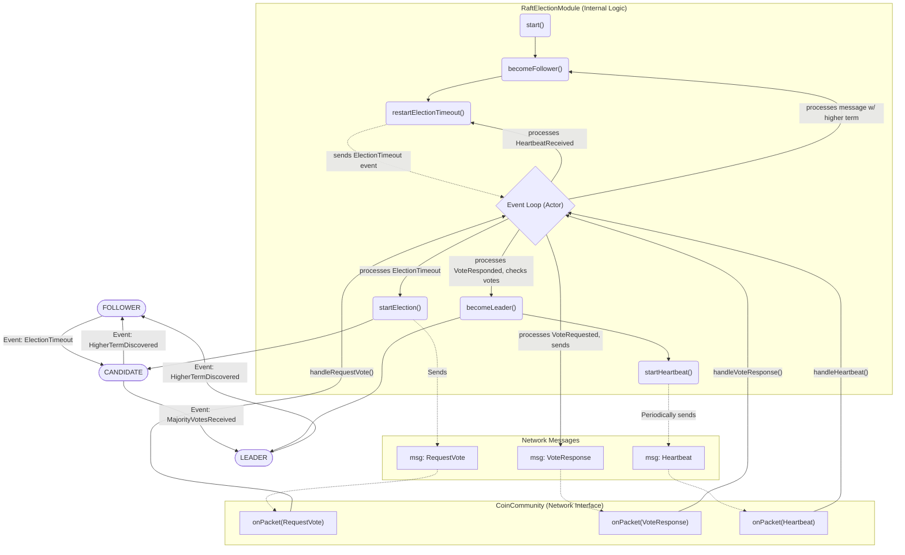

# CS4160 Blockchain Engineering 2025 - Democracy 2

## Part 1. FROST Threshold Signature Documentation

### 1. Introduction

FROST (Flexible Round-Optimized Schnorr Threshold) is a threshold signature scheme enabling distributed signing among multiple parties. This implementation integrates FROST with:

- **TrustChain**: For peer-to-peer messaging and data persistence  
- **Bitcoin**: For transaction creation and signature verification  
- **Raft Consensus(TBD)**: For coordinator election and fault tolerance

**Key Features:**

- Distributed Key Generation (DKG)  
- Non-interactive Signing  
- t-of-n Threshold Fault Tolerance  
- Coordinator-Optimized Signing Sessions

### 2. System Architecture
#### 2.1 Component Diagram


#### 2.2 Core Components

- **FrostKeyGenEngine**: Manages distributed key generation  
  - Polynomial generation  
  - Commitment broadcasting  
  - Share verification

- **FrostPreProcessingEngine**: Handles nonce preparation  
  - Pre-computes signing nonces  
  - Stores commitment data

- **FrostSigningEngine**: Orchestrates threshold signing  
  - Collects partial signatures  
  - Aggregates final signature  
  - Broadcasts completed signature

- **CoinCommunity**: TrustChain integration layer  
  - Message serialization and parsing  
  - Blockchain communication  
  - Peer discovery and networking

#### 2.3 System Overview




### 3. Key Generation Process (DKG)
#### 3.1 Protocol Flow

The Distributed Key Generation (DKG) process follows a two-round protocol:

1. **Round 1 - Commitment Phase**:
   - Each participant generates a random polynomial with coefficients in Zp
   - Computes and broadcasts polynomial commitments to TrustChain
   - Generates zero-knowledge proofs for commitment validity

2. **Round 2 - Verification Phase**:
   - Participants verify received commitments using the proofs
   - Each node computes and broadcasts their verification share
   - After collecting sufficient shares, the group public key is computed

This process ensures that:
- No single party knows the complete secret key
- The public key can be verified by all participants
- The scheme remains secure even if some participants are compromised



#### 3.2 Critical Code Snippets

​​Polynomial Generation​​:

```kotlin
// Sample polynomial coefficients
a = List(threshold) { randomZp() } 

// Compute commitments
commitment = a.map { coeff -> 
    FrostConstants.g.modPow(coeff, FrostConstants.p) 
}
```

​Zero-Knowledge Proof​​:

```kotlin
val k = randomZp()
val r = FrostConstants.g.modPow(k, FrostConstants.p)
val c = hashToBigInt("FROST-KeyGen", g_ai0, r, FrostConstants.n)
val z = k.add(ai0.multiply(c)).mod(FrostConstants.n)
proof = Pair(r, z)
```

### 4. Pre-processing Phase
#### 4.1 Nonce Generation Workflow
The pre-processing phase generates nonce/commitment pairs in advance to enable efficient signing operations:

1. **Nonce Pair Generation**:
   - Each participant generates π (pi) pairs of random nonces (d, e)
   - These nonces are single-use and must be kept secret until signing

2. **Commitment Computation**:
   - For each nonce pair, compute the corresponding commitments:
     - D = g^d mod p
     - E = g^e mod p
   - These commitments are safe to share publicly

3. **Storage and Distribution**:
   - Nonces are stored securely for future signing operations
   - Commitments are broadcast to the Signing Authority (SA) via TrustChain

This pre-processing provides:
- **Performance Optimization**: Computationally intensive operations done in advance
- **Signing Efficiency**: Enables fast response when signing requests arrive
- **Security**: Nonces remain secret until needed for signing



#### 4.2 Code Implementation
```kotlin
fun generate() {
    Li.clear()
    for (j in 1..pi) {
        val dij = randomZp()
        val eij = randomZp()
        val Dij = FrostConstants.g.modPow(dij, FrostConstants.p)
        val Eij = FrostConstants.g.modPow(eij, FrostConstants.p)
        Li.add(Pair(Dij, Eij))
    }
    broadcast(FrostNoncesToSAMessage(...))
}
```

### 5. Threshold Signing Protocol
#### 5.1 Signing Sequence
The threshold signing protocol enables distributed signature generation through a coordinated multi-step process:

1. **Signing Initiation**:
   - The Signing Authority (leader node) broadcasts a signing request containing:
     - Message hash to be signed
     - List of participating signers
     - Session identifiers

2. **Partial Signature Submission**:
   - Each participant retrieves their pre-generated nonce pair
   - Computes their partial signature z_i using:
     - Private key share
     - Nonce values
     - Binding factors
   - Submits partial signature to TrustChain

3. **Signature Aggregation**:
   - Signing Authority monitors TrustChain for responses
   - Validates each partial signature
   - Combines signatures once threshold is reached

4. **Finalization**:
   - Final aggregated signature is broadcast
   - Signature can be verified against group public key

Key properties:
- **Non-interactive**: Participants only need to submit one message
- **Robust**: Tolerates up to (threshold-1) unresponsive nodes
- **Verifiable**: Each step can be independently verified



#### 5.2 Signature Aggregation

```kotlin
fun onReceivedZi(participantIndex: Int, z_i: BigInteger) {
    collectedZi[participantIndex] = z_i
    finalSignature += z_i
    
    if (collectedZi.size * 100 >= threshold * storedNonces.size) {
        broadcast(FrostSigningResponseToJoinerMessage(...))
    }
}
```

Aggregation details:

- Threshold Check​​: Requires signatures from ≥t participants (where t is threshold)
- ​​Signature Combination​​: Simple modular addition of z_i values
- ​​Efficiency​​: O(1) aggregation operation regardless of group size
- ​​Security​​: Each z_i contains proof of knowledge of the secret share

The protocol ensures:

- ​​Correctness​​: Only valid signatures can be aggregated
- ​​Unforgeability​​: Requires cooperation of threshold participants
- ​​Consistency​​: All participants will compute the same final signature


### 6. TrustChain Integration
#### 6.1 Message Types

| Message Type                        | Purpose                            |
| ----------------------------------- | ---------------------------------- |
| `FrostBroadcastingTransaction`      | DKG commitments and shares         |
| `FrostSignatureAskTransaction`      | Signing request initiation         |
| `FrostResponseSignatureTransaction` | Partial signature submission       |
| `SWJoinBlockTransaction`            | Wallet creation and initialization |

#### 6.2 Message Handling

```kotlin
fun onFrostMessage(packet: Packet) {
    val payload = deserialize(packet)
    when (payload.messageType) {
        COMMITMENT -> processCommitment(...)
        VERIFICATION_SHARE -> processShare(...)
        // ... other types
    }
}
```


### 7. Security Mechanisms
#### 7.1 Cryptographic Guarantees


- ​​Verifiable Secret Sharing​​: Feldman VSS for share verification
- ​Binding Signatures​​: Prevents rogue key attacks
- Zero-Knowledge Proofs​​: Commitment verification

#### 7.2 Code-Level Protections

```kotlin
// Verifiable commitment check
fun verifyCommitment(commitment: List<BigInteger>, proof: Pair<BigInteger, BigInteger>): Boolean {
    val (r, z) = proof
    val c = hashToBigInt(...)
    val lhs = FrostConstants.g.modPow(z, p)
    val rhs = r.multiply(commitment[0].modPow(c, p)).mod(p)
    return lhs == rhs
}
```


### 8. Testing
The test suite validates the FROST protocol's distributed key generation (DKG) process through a simulated P2P environment:
```kotlin
@Test
fun testFullKeyGeneration() = runBlocking {
    // 1. Initialize test peers
    val peers = (0 until 5).map { Peer(generateKey()) }
    
    // 2. Create parallel DKG engines
    val results = peers.map { peer ->
        async {
            FrostKeyGenEngine(
                threshold = 3,
                participantId = peer.id,
                participants = peers,
                send = { dest, data -> routeMessage(peer, dest, data) }
            ).generate()
        }
    }.awaitAll()

    // 3. Verify cryptographic invariants
    results.forEach {
        assertTrue(it.success)
        assertEquals(peers.size, it.participants.size) 
        assertNotNull(it.groupPublicKey)
    }
    
    // 4. Validate consensus
    assertAllEqual(results.map { it.groupPublicKey })
}
```
Key verification aspects:

- Correctness​​: All nodes complete DKG successfully
- ​​Consistency​​: Identical group key computation
- ​​Completeness​​: Full participant set recognition
- ​​Threshold Enforcement​​: t-of-n validity checks

The test uses coroutines to model real network concurrency while maintaining deterministic verification through controlled crypto parameters.


### 9. Conclusion

This implementation offers a  FROST threshold signature system, with:

- Full DKG and signing workflows  
- TrustChain-based message relay and persistence  
- Bitcoin integration for real transaction signing

**Planned Improvements:**

- Raft-assisted coordination  
- Proactive secret resharing  
- Multi-chain compatibility  
- Formal security verification  
- Mobile-optimized client performance


## Part 2. Raft Leader Election Documentation

### 1 Introduction

#### 1.1 Implement Overview

This implementation focuses on the implementation of a robust and fault-tolerant leader election mechanism for a peer-to-peer (P2P) network. The primary objective is to elect a single, temporary coordinator node from a group of peers. This coordinator is crucial for orchestrating complex, multi-round cryptographic protocols, specifically the Flexible Round-Optimized Schnorr Threshold (FROST) signature scheme. In FROST, a designated leader simplifies the communication flow by collecting and distributing messages for each round of the signing process, ensuring efficiency and order.

The implementation is built upon the **IPv8 P2P framework**, which provides the underlying networking layer for peer discovery, communication, and message dispatching. This allows the project to focus on the application-level logic of the consensus algorithm rather than the intricacies of network management.

A key design decision was to use a **fixed, predefined set of nodes** for the election process. This simplifies the consensus model by removing the complexities associated with dynamic membership changes, which is a suitable trade-off for the intended use case where the set of signing parties is known in advance.

#### 1.2 Algorithm Choice and Scope: Raft

The **Raft consensus algorithm** was selected for this project due to its design emphasis on understandability and fault tolerance. While Raft is a comprehensive algorithm for managing a replicated state machine, this project leverages only its core **leader election and heartbeat mechanisms**. The log replication components are intentionally omitted as they are not required for the sole purpose of electing a coordinator.

The implemented logic includes:
*   **Leader Election:** The process by which nodes transition from followers to candidates to elect a new leader.
*   **Term-based Logic:** The use of monotonically increasing "terms" to act as a logical clock, resolving conflicts and ensuring protocol progress.
*   **Heartbeats:** Periodic messages sent by the leader to assert its authority and prevent followers from starting unnecessary new elections.

#### 1.3 Testing and Verification

To ensure the correctness and robustness of the implementation, a comprehensive, multi-layered testing strategy was employed.

##### 1.3.1 Unit Tests
Unit tests were developed to validate the core logic of the `RaftElectionModule` and `RaftElectionMessage` in isolation. These tests verify individual state transitions, term management, and voting logic under a variety of controlled scenarios.

For `RaftElectionModule`, we used fixed random seed and Kotlin coroutine test utilities to simulate the passage of time and control the election timers. This allowed us to test the module's behavior under predictable conditions.

##### 1.3.2 Single-Machine Simulation Test
A local simulation environment was created in `RaftTestLocalActivity.kt`. This test runs a complete, multi-node Raft cluster on a single device.
*   **`SimulatedRaftNode`**: Represents a virtual node, each with its own instance of `RaftElectionModule`.
*   **`RaftMessageBroker`**: Acts as a virtual network, intercepting and routing messages between the simulated nodes.

This setup allows for deterministic testing of the algorithm's behavior and fault tolerance. For example, by "disconnecting" the current leader from the message broker, we can reliably trigger and observe the subsequent re-election process among the remaining nodes.

````kotlin
    private fun disconnectNode() {
// ...
        // Find the current leader
        val leaderPeer = connectedNodes.firstOrNull()?.raftModule?.getCurrentLeader()
// ...
        val leaderNode = connectedNodes.find { it.peer == leaderPeer }
// ...
        // Disconnect the leader node
        connectedNodes.remove(leaderNode)
        leaderNode.raftModule.stop()
        messageBroker.unregisterNode(leaderNode)
        disconnectedNodes.add(leaderNode)

        logMessage("Disconnected leader node: ${leaderNode.nodeId.substring(0, 5)}")
        runOnUiThread { updateUI() }
    }
````

##### 1.3.3 Cross-Machine Network Test
The `RaftTestActivity.kt` provides a user interface for testing the implementation across multiple devices on a real network. This activity interacts directly with the live `CoinCommunity` and its `RaftElectionModule`. It allows an operator to:
*   Observe the real-time state (Follower, Candidate, Leader), term, and current leader of the local node.
*   View a list of all peers discovered and participating in the Raft cluster.
*   Manually trigger the cluster initialization.

This test serves as the final validation, proving that the implementation works correctly in an asynchronous, real-world P2P environment with actual network latency and conditions.

### 2 Algorithm Process and State Transitions

The implemented Raft-based election mechanism operates as a finite state machine. The core of the implementation resides in the `RaftElectionModule.kt` file, which is designed using an actor-like model with Kotlin Coroutines to ensure that all state modifications are handled sequentially, thus avoiding race conditions without the need for complex locking mechanisms.

Each node in the network can exist in one of three distinct states: **Follower**, **Candidate**, or **Leader**. Transitions between these states are driven by events, which are sent to a central `Channel` and processed by a single event loop. This makes the system's behavior predictable and easier to debug. The entire process is governed by a logical clock, known as a "term," which ensures that the system progresses logically and resolves conflicts.

````kotlin
// ...
private sealed class RaftEvent {
    data class VoteRequested(val peer: Peer, val message: RaftElectionMessage.RequestVote) : RaftEvent()
    data class VoteResponded(val peer: Peer, val term: Int, val voteGranted: Boolean) : RaftEvent()
    data class HeartbeatReceived(val from: Peer, val term: Int, val leaderId: String) : RaftEvent()
    object ElectionTimeout : RaftEvent()
    object ForceElection: RaftEvent()
}

class RaftElectionModule(
// ...
    private val eventChannel = Channel<RaftEvent>(Channel.UNLIMITED)
// ...
    private fun runEventLoop() {
        moduleScope.launch {
            for (event in eventChannel) {
                when (event) {
                    is RaftEvent.VoteRequested -> processRequestVote(event.peer, event.message)
                    is RaftEvent.VoteResponded -> processVoteResponse(event.peer, event.term, event.voteGranted)
                    is RaftEvent.HeartbeatReceived -> processHeartbeat(event.from, event.term, event.leaderId)
                    is RaftEvent.ElectionTimeout -> startElection()
                    is RaftEvent.ForceElection -> startElection()
                }
            }
        }
    }
// ...
}
````

The general election process flows as follows:
1.  **Timeout**: A `FOLLOWER` starts a randomized election timer. If this timer expires without receiving a heartbeat from a valid leader, it sends an `ElectionTimeout` event to itself.
2.  **Candidacy**: Upon processing the timeout event, the node transitions to the `CANDIDATE` state. It increments the `currentTerm`, votes for itself, and broadcasts a `RequestVote` message to all other peers in the cluster.
3.  **Voting**: Followers that receive a `RequestVote` message will grant their vote if the candidate's term is valid and they have not yet voted in the current term.
4.  **Leadership**: If the `CANDIDATE` receives votes from a majority of the nodes in the cluster, it transitions to the `LEADER` state.
5.  **Heartbeats**: The new `LEADER` immediately begins sending periodic `Heartbeat` messages to all followers. This asserts its authority and resets the followers' election timers, preventing new elections.

The `CoinCommunity.kt` class integrates the `RaftElectionModule` with the IPv8 network. It implements the `RaftSendDelegate` interface, providing a `raftSend` method that the module uses to dispatch messages. It also defines message handlers that deserialize incoming network packets and convert them into the appropriate `RaftEvent` for the module's event loop.

````kotlin
// ...
interface RaftSendDelegate {
    fun raftSend(peer: Peer, messageId: Int, payload: nl.tudelft.ipv8.messaging.Serializable)
    val myPeer: Peer
}

// ...
    // handle RequestVote
    private fun onRequestVote(packet: Packet) {
        val (peer, message) = packet.getAuthPayload(RaftElectionMessage.RequestVote)
        Log.d("RaftMsg", "Received RequestVote from ${peer.mid}, term=${message.term}. Delegating to Raft module.")

        // Simply delegate the entire handling to the Raft module
        raftElectionModule.handleRequestVote(peer, message)
    }
// ...
````

The following sections describe each state in detail.

#### 2.1 State: Follower

The **Follower** is the default, passive state for all nodes.

*   **Entry Condition**:
    1.  A node starts in the `FOLLOWER` state upon initialization.
    2.  A `CANDIDATE` or `LEADER` will revert to the `FOLLOWER` state if it receives a message from another peer with a higher `term` number. This indicates that its own information is outdated.

*   **Behavior**:
    *   A Follower does not initiate any communication. It passively listens for messages.
    *   It maintains a randomized **election timer**. This timer is reset every time it receives a valid `Heartbeat` from the current leader.
    *   If it receives a `RequestVote` message, it will grant its vote to the candidate under specific conditions (e.g., the candidate's term is valid and the follower has not yet voted in the current term).

*   **State Transition (to Candidate)**:
    *   If the follower's election timer expires without receiving a `Heartbeat` from a leader, it assumes the leader has failed or a network partition has occurred. It then transitions to the `CANDIDATE` state to initiate a new election. This is triggered by the `ElectionTimeout` event.

The `becomeFollower` function centralizes the logic for entering this state, ensuring the term is updated and timers are correctly managed.

````kotlin
    private fun becomeFollower(term: Int){
        Log.d(TAG, "${getSelfNodeIdDisplay()}: Becoming follower for term $term")
        currentState = NodeState.FOLLOWER
        currentTerm = term
        votedFor = null
        heartbeatJob?.cancel()
        restartElectionTimeout()
    }
````

#### 2.2 State: Candidate

The **Candidate** is an active state where a node is actively trying to become the new leader.

*   **Entry Condition**:
    *   A `FOLLOWER`'s election timer expires.

*   **Behavior**:
    1.  **Increment Term**: The node immediately increments the `currentTerm`.
    2.  **Vote for Self**: It casts a vote for itself.
    3.  **Reset Timer**: It restarts its own election timer.
    4.  **Broadcast Votes**: It sends `RequestVote` messages to all other peers in the cluster, asking them for their vote in the new term.

The `startElection` function handles the transition to the `CANDIDATE` state and the broadcasting of vote requests.

````kotlin
    private fun startElection() {
        // All state changes are now safe without synchronized block
        currentTerm++
        currentState = NodeState.CANDIDATE
        votedFor = nodeId
        currentVotes = 1 // vote for itself
        Log.d(TAG, "${getSelfNodeIdDisplay()}: Starting election for term $currentTerm")

        restartElectionTimeout()

        val peersCopy = peers.toSet()
        val message = RaftElectionMessage.RequestVote(currentTerm, nodeId)
        peersCopy.forEach { peer ->
            community.raftSend(peer, RaftElectionMessage.REQUEST_VOTE_ID, message)
            Log.d(TAG, "Node ${getSelfNodeIdDisplay()} Sent RequestVote to ${getNodeIdDisplay(peer)} for term $currentTerm")
        }
    }
````

*   **State Transitions**:
    *   **Transition to Leader**: If the candidate receives `VoteResponse` messages granting a vote from a majority of the nodes in the cluster, it wins the election and transitions to the `LEADER` state.
    *   **Transition to Follower**: If, while waiting for votes, it receives a `Heartbeat` from another peer claiming to be the leader for the current or a higher term, it recognizes the new leader, cancels its candidacy, and transitions back to `FOLLOWER`.
    *   **Remain Candidate (Split Vote)**: If the election timer expires again before a winner is decided (a "split vote" scenario where no candidate gets a majority), it remains a `CANDIDATE`, increments the term, and starts another election round.

#### 2.3 State: Leader

The **Leader** is the single, active node responsible for managing the cluster. In the context of this project, it is the designated FROST coordinator.

*   **Entry Condition**:
    *   A `CANDIDATE` receives votes from a majority of its peers.

*   **Behavior**:
    *   Upon becoming leader, it immediately stops its election timer.
    *   It begins broadcasting periodic `Heartbeat` messages to all other nodes. These heartbeats serve two purposes:
        1.  To assert its authority as the leader.
        2.  To prevent followers from timing out and starting unnecessary new elections.

The `becomeLeader` and `startHeartbeat` functions manage this transition and the subsequent periodic task.

````kotlin
    private fun becomeLeader() {
        if(currentState == NodeState.LEADER) return

        Log.d(TAG, "${getSelfNodeIdDisplay()}: Becoming leader for term $currentTerm")
        currentState = NodeState.LEADER
        currentLeader = community.myPeer
        votedFor = null
        electionTimeOut?.cancel()
        onLeaderChangedCallback?.invoke(community.myPeer)
        startHeartbeat()
    }

    private fun startHeartbeat() {
        heartbeatJob?.cancel()
        heartbeatJob = moduleScope.launch {
            while(isActive && currentState == NodeState.LEADER) {
                sendHeartbeats()
                delay(heartbeatIntervalMs)
            }
        }
    }
````

*   **State Transition (to Follower)**:
    *   A `LEADER` will immediately step down and transition back to the `FOLLOWER` state if it receives a message from another peer with a higher `term` number. This ensures that a "deposed" leader (e.g., one that was temporarily disconnected from the network) cannot continue to issue commands, maintaining the integrity of the system.

**State tranfer graph:**




**Message flow diagram:**

Old (synchronize-based version):


New (Actor model):


### 3 Technical Challenges and Tradeoffs

Developing a distributed consensus algorithm presents significant challenges. In this project, concurrency and state management are the two main issues. This section details the evolution of the implementation as these challenges were identified and addressed.

#### 3.1 Concurrency Problems

The core of the Raft module involves multiple independent processes running concurrently: **handling incoming network messages**, **managing election timers**, and **sending periodic heartbeats**. The initial implementation suffered from classic concurrency issues that are common in such systems.

##### 3.1.1 Deadlocks and the Move to Coroutines

The first version of the `RaftElectionModule` relied on traditional thread-safety mechanisms, primarily using `synchronized(this)` blocks to protect all access to shared state variables like `currentState`, `currentTerm`, and `votedFor`.

*   **Initial Problem**: While this approach seemed straightforward, it quickly led to intermittent and hard-to-diagnose **deadlocks**. A typical deadlock scenario would occur when:
    1.  The election timer coroutine fires, acquires the lock on the module, and begins the `startElection` process.
    2.  As part of this process, it attempts to send a `RequestVote` message over the network via the `community.raftSend()` delegate.
    3.  Simultaneously, an incoming network packet (e.g., a `Heartbeat` from another node) arrives, and the IPv8 network thread calls a message handler like `onHeartbeat`.
    4.  This network thread would then try to acquire the same lock on the module to process the heartbeat, but it would be blocked, waiting for the election coroutine to release it.
    5.  If the `raftSend` operation was also blocking or waiting on some other resource held by the network thread, a deadlock would occur, freezing the module.

These deadlocks were particularly insidious because they were not stable and occurred more frequently (both creating the cluster or connecting / disconnecting new nodes) as the number of nodes in the single-machine test (`RaftTestLocalActivity`) was increased, due to the higher volume and more complex timing of messages.

*   **Evolution to Coroutines**: To resolve this, the design was shifted away from coarse-grained locking towards a more structured concurrency model using Kotlin Coroutines.
    *   **Intermediate Step (Anti-pattern)**: The first attempt combined coroutines with `synchronized` blocks. This was not a good practice, as it mixed blocking and non-blocking paradigms, making the code harder to reason about and failing to solve the underlying deadlock potential.
    *   **Pure Coroutine Solution (Actor Model)**: The final, robust implementation refactored the module to follow an **Actor-like pattern**. This is the most significant technical decision made to ensure correctness. All state-mutating logic was moved into a single event loop that processes events from a `Channel`. This serializes all state changes, completely eliminating the need for locks and the possibility of deadlocks.

```kotlin
// Step 1: Define all possible events that can change the module's state.
private sealed class RaftEvent {
// ...
}

class RaftElectionModule(
// ...
    // Step 2: Create a Channel to act as an event queue.
    private val eventChannel = Channel<RaftEvent>(Channel.UNLIMITED)
// ...
    // The core of the Actor model: a single coroutine that processes all events sequentially.
    private fun runEventLoop() {
        moduleScope.launch {
            for (event in eventChannel) {
                when (event) {
                    is RaftEvent.VoteRequested -> processRequestVote(event.peer, event.message)
                    is RaftEvent.VoteResponded -> processVoteResponse(event.peer, event.term, event.voteGranted)
                    is RaftEvent.HeartbeatReceived -> processHeartbeat(event.from, event.term, event.leaderId)
                    is RaftEvent.ElectionTimeout -> startElection()
                    is RaftEvent.ForceElection -> startElection()
                }
            }
        }
    }
// ...
    // Step 4: Public-facing handlers now just send events and return immediately.
    fun handleRequestVote(peer: Peer, message: RaftElectionMessage.RequestVote) {
        eventChannel.trySend(RaftEvent.VoteRequested(peer, message))
    }
// ...
}
```

##### 3.1.2 Data Races

The `synchronized` approach also presented a high risk of data races if not applied perfectly.

*   **Peer Set Modification** (Data structure concurrent safety problems under `synchronized` blocks): The `peers` set was a critical shared resource. A coroutine sending heartbeats could be iterating over this set at the exact moment an external call to `addPeer` or `removePeer` was modifying it, which would cause a `ConcurrentModificationException` and crash the module. While using a `ConcurrentHashMap` or `CopyOnWriteArraySet` could solve this specific issue, the Actor model provides a more holistic solution by ensuring all access (reads and writes) to the peer list is also handled within the single event loop. In the current implementation, a copy of the set is made before iteration (`val peersCopy = peers.toSet()`) which is a safe and simple workaround.

*   **Inconsistent State**: The most dangerous data race involves the node's state itself. Without the event loop, it was possible for a node's state to be read and acted upon while it was in the process of being changed by another thread. For example, a node could time out and decide to become a `CANDIDATE`, but before it could send vote requests, it might process a `Heartbeat` from a new leader. This could lead to a race where the node becomes a `FOLLOWER` but still sends out stale `RequestVote` messages, which causes confusion in the cluster. The Actor model prevents this by ensuring each event is processed to completion before the next one begins.

##### 3.1.3 Robust Coroutine Lifetime Management

A final technical challenge was to make sure that the coroutines used for timers and background tasks were managed correctly and did not leak resources, where we found the coroutine was still sending `raft` messages after the app was killed.

*   **The Solution**: A dedicated `CoroutineScope` (`moduleScope`) is created for each `RaftElectionModule` instance, configured with a `SupervisorJob`.
    *   **`SupervisorJob`**: This is a crucial choice. It ensures that if a child coroutine (e.g., a single heartbeat task) fails with an exception, it does not propagate the failure upwards and cancel the entire `moduleScope`. This makes the module more resilient.
    *   **Lifecycle Control**: The `start()` method launches the main event loop, and the `stop()` method explicitly calls `moduleScope.cancel()`. This single action cleanly terminates the event loop and cancels all child jobs launched within that scope, including the `electionTimeOut` timer and the `heartbeatJob`. This prevents coroutines from running in the background after the module is considered "stopped," which is essential for preventing memory leaks and unpredictable behavior in the Android application lifecycle.


#### 3.2 The Election Set Problem

A fundamental requirement of the Raft algorithm is that all participating nodes have a clear and consistent understanding of the total cluster membership. The majority calculation (requiring `(N/2) + 1` votes) is the cornerstone of Raft's safety guarantees. If nodes have different views of what constitutes the total set of voters (`N`), the entire consensus mechanism would break down.

This presents a significant challenge in a dynamic P2P network where nodes can join and leave at will. An inconsistent network view among nodes can easily lead to a **"split-brain"** scenario. For example, if a network partition occurs, each isolated segment might believe it has a majority of *its* perceived cluster members, which lead to the election of multiple, competing leaders. This would violate the core principle of having a single, authoritative coordinator.

Several strategies were considered to address this challenge, each with its own set of tradeoffs.

##### 3.2.1 Solution 1: Fixed Membership Set (The Chosen Approach)

This approach defines the set of nodes eligible for election as a fixed, pre-configured list. All nodes are initialized with the same list of peers that form the Raft cluster.

*   **Pros**:
    *   **Simplicity and Safety**: It is the simplest and safest way to guarantee that all nodes agree on the cluster size (`N`), thereby making sure the integrity of the majority calculation.
    *   **Proven in Practice**: This model is widely used and proven in production systems that use Raft for coordination, such as **etcd** (the backing store for Kubernetes), **Consul**, and **TiDB**. These systems typically require an administrator to explicitly add or remove nodes from the cluster configuration.

*   **Cons**:
    *   **Inflexibility**: The primary drawback is its lack of flexibility. It cannot dynamically accommodate new nodes joining the network who wish to participate in the election, nor can it gracefully handle the permanent departure of a node without manual reconfiguration.

*   **Tradeoff Decision**: For the specific use case of coordinating a FROST signature, the set of signing parties is typically known and agreed upon before the signing ceremony begins. Therefore, the inflexibility of a fixed set is an acceptable tradeoff. The simplicity and safety it provides far outweigh the need for dynamic membership for this project's scope. The implementation reflects this by having the `RaftElectionModule` initialized with a specific set of peers.

##### 3.2.2 Solution 2: Centralized Registration Center

This solution would involve a trusted, central server or a well-known endpoint that acts as a registry. Nodes would register with this center to join the election set, and all nodes would query this center to get the authoritative list of current members.

*   **Pros**:
    *   Provides a single source of truth for cluster membership, solving the consistency problem.

*   **Cons**:
    *   **High Complexity and Cost**: It introduces a new, **single point of failure** and a **potential performance bottleneck** (latency). Maintaining such a service adds significant operational overhead.
    *   **Security Risks**: A centralized service could become a target for attacks, and if compromised, it could lead to incorrect membership information being distributed.
    *   **Violates Decentralization**: It runs counter to the decentralized ethos of P2P and blockchain systems.

##### 3.2.3 Solution 3: On-Chain Membership Management

This approach would leverage the underlying blockchain to manage the election set. Before an election is needed, a transaction containing the full list of participating members for the next term could be proposed and recorded on the blockchain. All nodes would then read this list from the immutable ledger.

*   **Pros**:
    *   Provides a decentralized and verifiable source of truth for the membership set.

*   **Cons**:
    *   **Slow**: Writing to a blockchain and waiting for block confirmation is a slow process This introduces significant latency before an election could even begin. This is unsuitable for a rapid leader election protocol.
    *   **Cost**: On most public blockchains, every transaction incurs a fee. While this might not be "real" money in a private or test network, it still represents a computational or resource cost.
    *   **Reduced Advantage**: While seemingly decentralized, it makes the fast, off-chain election protocol dependent on the slower, on-chain layer for its configuration. This negates some of the speed advantages of using an algorithm like Raft in the first place.

Given these considerations, the pragmatic and effective choice for this project was to adopt the **fixed membership set**. It aligns perfectly with the requirements of the FROST use case and avoids the significant complexity and performance penalties of the other solutions.

#### 3.3 IPv8 Framework Limitations

During the development of adapting to cross-machine practice, a significant limitation within the IPv8 framework was discovered. The default networking and peer discovery mechanisms in IPv8 are designed for real-world scenarios where each peer has a unique IP address. The framework, by default, **does not** properly support running multiple, distinct peer instances bound to the same IP address and port on a single machine.

When attempting to using multiple machines in the same network environment, IPv8 would often treat all instances as a single peer, or messages would fail to route correctly between the simulated nodes. This made it impossible to reliably test the P2P communication aspects of the Raft implementation on one device or single network environment.

Considerable effort, spanning over a week, was invested in diving into the IPv8 source code to find a workaround. This involved attempting to manually manage peer tables, message routing, considering internal network penetration. However, modifying the core behavior of the networking framework proved to be complex and brittle. Ultimately, the most pragmatic solution was to pivot the testing strategy. The true network validation had to be performed on multiple physical or virtual machines, with each different network environment (Wi-Fi in dormitories/mobile hotspot/eduroam).

#### 3.4 Integration with FROST

The original goal of this part was to fully integrate the completed Raft election module with a FROST threshold signature implementation. The elected leader would act as the coordinator for the multi-round signing protocol.

Unfortunately, the workload required to design, implement, and thoroughly debug a robust and concurrent Raft module far exceeded initial estimates. The challenges detailed in this section, particularly solving the concurrency deadlocks and working around framework limitations, took a significant portion of the project's development time.

As a result, a difficult but necessary decision was made to scope down this part of the whole project and leave the final integration with FROST as a direction for future work. The priority shifted to delivering a correct, stable, and well-tested leader election mechanism, which could serve as a solid foundation for that future integration.

### 4 Conclusion

This part of project successfully designed and implemented a fault-tolerant leader election mechanism based on the Raft consensus algorithm, modified for coordinating cryptographic protocols in a P2P environment. Built upon the IPv8 framework, the module provides a robust method for electing a single leader from a fixed set of peers.

The development process faced significant technical challenges, most notably in the area of concurrency control. The initial lock-based approach proved susceptible to deadlocks, which leads to a complete redesign around a non-blocking, Actor-like model using Kotlin Coroutines and Channels. This architectural shift was critical to achieving a stable and correct implementation. Furthermore, a deliberate tradeoff was made to use a fixed, pre-configured election set, prioritizing safety and simplicity over the complexity of dynamic membership, which aligns with the intended use case.

Comprehensive testing was performed through unit tests, a single-machine simulation with a mocked network layer, and a final, real-world test across multiple machines. While the final integration with the FROST signature scheme was deferred due to the unforeseen complexity of building the consensus layer, this work delivers a proven and reliable leader election module. It stands as a complete and functional component, providing a solid foundation upon which the full FROST coordination logic can be built in future work.
