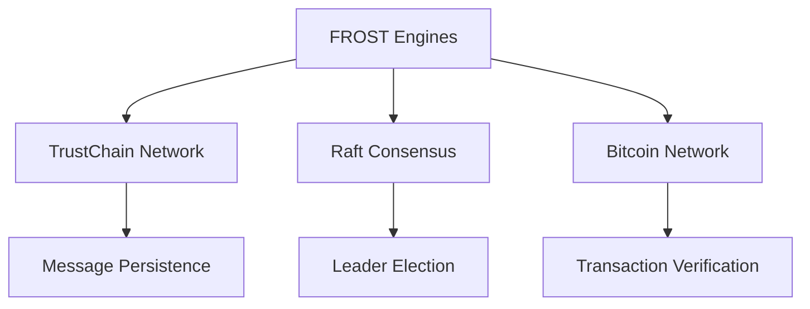
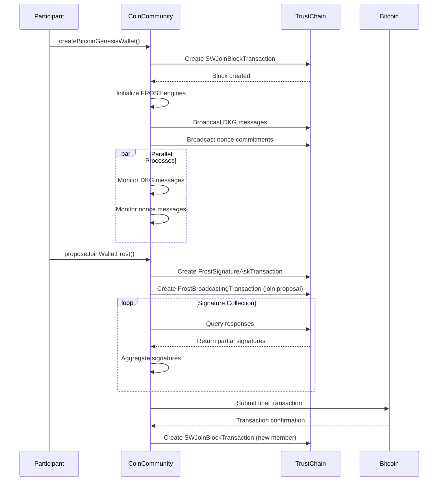
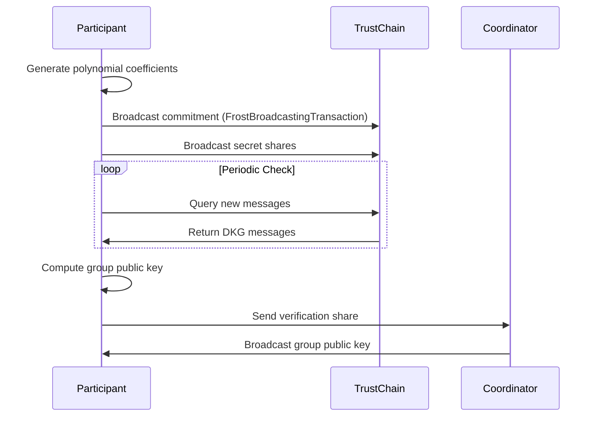
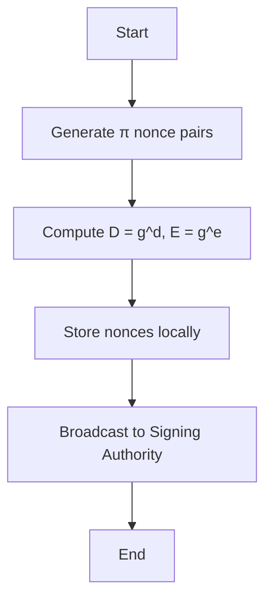
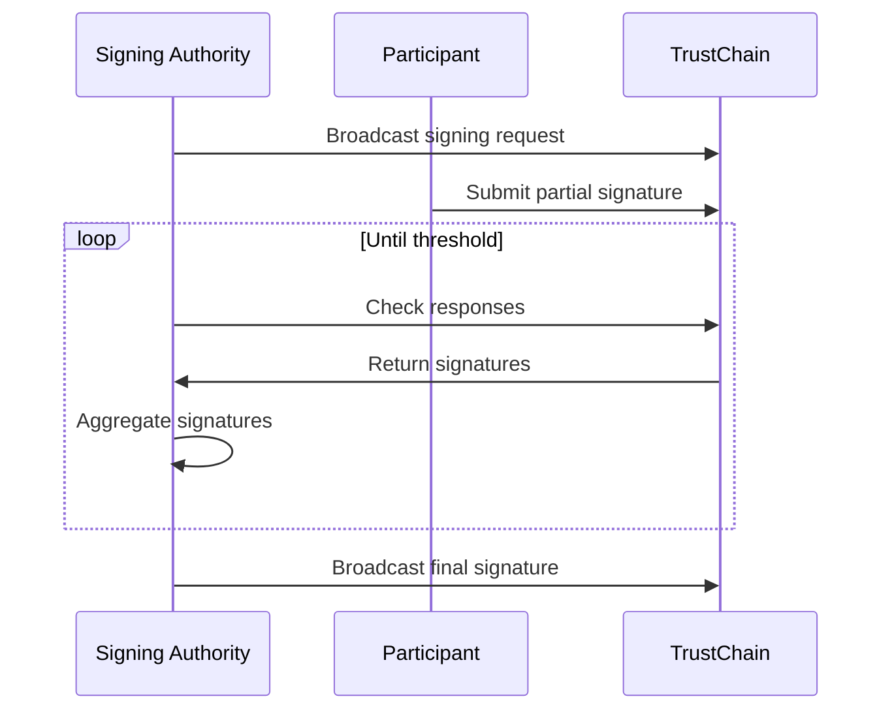

## FROST Threshold Signature Documentation

### 1. Introduction

FROST (Flexible Round-Optimized Schnorr Threshold) is a threshold signature scheme enabling distributed signing among multiple parties. This implementation integrates FROST with:

- **TrustChain**: For peer-to-peer messaging and data persistence  
- **Bitcoin**: For transaction creation and signature verification  
- **Raft Consensus(TBD)**: For coordinator election and fault tolerance

**Key Features:**

- Distributed Key Generation (DKG)  
- Non-interactive Signing  
- t-of-n Threshold Fault Tolerance  
- Coordinator-Optimized Signing Sessions

### 2. System Architecture
#### 2.1 Component Diagram


#### 2.2 Core Components

- **FrostKeyGenEngine**: Manages distributed key generation  
  - Polynomial generation  
  - Commitment broadcasting  
  - Share verification

- **FrostPreProcessingEngine**: Handles nonce preparation  
  - Pre-computes signing nonces  
  - Stores commitment data

- **FrostSigningEngine**: Orchestrates threshold signing  
  - Collects partial signatures  
  - Aggregates final signature  
  - Broadcasts completed signature

- **CoinCommunity**: TrustChain integration layer  
  - Message serialization and parsing  
  - Blockchain communication  
  - Peer discovery and networking

#### 2.3 System Overview




### 3. Key Generation Process (DKG)
#### 3.1 Protocol Flow

The Distributed Key Generation (DKG) process follows a two-round protocol:

1. **Round 1 - Commitment Phase**:
   - Each participant generates a random polynomial with coefficients in Zp
   - Computes and broadcasts polynomial commitments to TrustChain
   - Generates zero-knowledge proofs for commitment validity

2. **Round 2 - Verification Phase**:
   - Participants verify received commitments using the proofs
   - Each node computes and broadcasts their verification share
   - After collecting sufficient shares, the group public key is computed

This process ensures that:
- No single party knows the complete secret key
- The public key can be verified by all participants
- The scheme remains secure even if some participants are compromised



#### 3.2 Critical Code Snippets

​​Polynomial Generation​​:

```kotlin
// Sample polynomial coefficients
a = List(threshold) { randomZp() } 

// Compute commitments
commitment = a.map { coeff -> 
    FrostConstants.g.modPow(coeff, FrostConstants.p) 
}
```

​Zero-Knowledge Proof​​:

```kotlin
val k = randomZp()
val r = FrostConstants.g.modPow(k, FrostConstants.p)
val c = hashToBigInt("FROST-KeyGen", g_ai0, r, FrostConstants.n)
val z = k.add(ai0.multiply(c)).mod(FrostConstants.n)
proof = Pair(r, z)
```

### 4. Pre-processing Phase
#### 4.1 Nonce Generation Workflow
The pre-processing phase generates nonce/commitment pairs in advance to enable efficient signing operations:

1. **Nonce Pair Generation**:
   - Each participant generates π (pi) pairs of random nonces (d, e)
   - These nonces are single-use and must be kept secret until signing

2. **Commitment Computation**:
   - For each nonce pair, compute the corresponding commitments:
     - D = g^d mod p
     - E = g^e mod p
   - These commitments are safe to share publicly

3. **Storage and Distribution**:
   - Nonces are stored securely for future signing operations
   - Commitments are broadcast to the Signing Authority (SA) via TrustChain

This pre-processing provides:
- **Performance Optimization**: Computationally intensive operations done in advance
- **Signing Efficiency**: Enables fast response when signing requests arrive
- **Security**: Nonces remain secret until needed for signing



#### 4.2 Code Implementation
```kotlin
fun generate() {
    Li.clear()
    for (j in 1..pi) {
        val dij = randomZp()
        val eij = randomZp()
        val Dij = FrostConstants.g.modPow(dij, FrostConstants.p)
        val Eij = FrostConstants.g.modPow(eij, FrostConstants.p)
        Li.add(Pair(Dij, Eij))
    }
    broadcast(FrostNoncesToSAMessage(...))
}
```

### 5. Threshold Signing Protocol
#### 5.1 Signing Sequence
The threshold signing protocol enables distributed signature generation through a coordinated multi-step process:

1. **Signing Initiation**:
   - The Signing Authority (leader node) broadcasts a signing request containing:
     - Message hash to be signed
     - List of participating signers
     - Session identifiers

2. **Partial Signature Submission**:
   - Each participant retrieves their pre-generated nonce pair
   - Computes their partial signature z_i using:
     - Private key share
     - Nonce values
     - Binding factors
   - Submits partial signature to TrustChain

3. **Signature Aggregation**:
   - Signing Authority monitors TrustChain for responses
   - Validates each partial signature
   - Combines signatures once threshold is reached

4. **Finalization**:
   - Final aggregated signature is broadcast
   - Signature can be verified against group public key

Key properties:
- **Non-interactive**: Participants only need to submit one message
- **Robust**: Tolerates up to (threshold-1) unresponsive nodes
- **Verifiable**: Each step can be independently verified



#### 5.2 Signature Aggregation

```kotlin
fun onReceivedZi(participantIndex: Int, z_i: BigInteger) {
    collectedZi[participantIndex] = z_i
    finalSignature += z_i
    
    if (collectedZi.size * 100 >= threshold * storedNonces.size) {
        broadcast(FrostSigningResponseToJoinerMessage(...))
    }
}
```

Aggregation details:

- Threshold Check​​: Requires signatures from ≥t participants (where t is threshold)
- ​​Signature Combination​​: Simple modular addition of z_i values
- ​​Efficiency​​: O(1) aggregation operation regardless of group size
- ​​Security​​: Each z_i contains proof of knowledge of the secret share

The protocol ensures:

- ​​Correctness​​: Only valid signatures can be aggregated
- ​​Unforgeability​​: Requires cooperation of threshold participants
- ​​Consistency​​: All participants will compute the same final signature


### 6. TrustChain Integration
#### 6.1 Message Types

| Message Type                        | Purpose                            |
| ----------------------------------- | ---------------------------------- |
| `FrostBroadcastingTransaction`      | DKG commitments and shares         |
| `FrostSignatureAskTransaction`      | Signing request initiation         |
| `FrostResponseSignatureTransaction` | Partial signature submission       |
| `SWJoinBlockTransaction`            | Wallet creation and initialization |

#### 6.2 Message Handling

```kotlin
fun onFrostMessage(packet: Packet) {
    val payload = deserialize(packet)
    when (payload.messageType) {
        COMMITMENT -> processCommitment(...)
        VERIFICATION_SHARE -> processShare(...)
        // ... other types
    }
}
```


### 7. Security Mechanisms
#### 7.1 Cryptographic Guarantees


- ​​Verifiable Secret Sharing​​: Feldman VSS for share verification
- ​Binding Signatures​​: Prevents rogue key attacks
- Zero-Knowledge Proofs​​: Commitment verification

#### 7.2 Code-Level Protections

```kotlin
// Verifiable commitment check
fun verifyCommitment(commitment: List<BigInteger>, proof: Pair<BigInteger, BigInteger>): Boolean {
    val (r, z) = proof
    val c = hashToBigInt(...)
    val lhs = FrostConstants.g.modPow(z, p)
    val rhs = r.multiply(commitment[0].modPow(c, p)).mod(p)
    return lhs == rhs
}
```


### 8. Testing
The test suite validates the FROST protocol's distributed key generation (DKG) process through a simulated P2P environment:
```kotlin
@Test
fun testFullKeyGeneration() = runBlocking {
    // 1. Initialize test peers
    val peers = (0 until 5).map { Peer(generateKey()) }
    
    // 2. Create parallel DKG engines
    val results = peers.map { peer ->
        async {
            FrostKeyGenEngine(
                threshold = 3,
                participantId = peer.id,
                participants = peers,
                send = { dest, data -> routeMessage(peer, dest, data) }
            ).generate()
        }
    }.awaitAll()

    // 3. Verify cryptographic invariants
    results.forEach {
        assertTrue(it.success)
        assertEquals(peers.size, it.participants.size) 
        assertNotNull(it.groupPublicKey)
    }
    
    // 4. Validate consensus
    assertAllEqual(results.map { it.groupPublicKey })
}
```
Key verification aspects:

- Correctness​​: All nodes complete DKG successfully
- ​​Consistency​​: Identical group key computation
- ​​Completeness​​: Full participant set recognition
- ​​Threshold Enforcement​​: t-of-n validity checks

The test uses coroutines to model real network concurrency while maintaining deterministic verification through controlled crypto parameters.


### 9. Conclusion

This implementation offers a  FROST threshold signature system, with:

- Full DKG and signing workflows  
- TrustChain-based message relay and persistence  
- Bitcoin integration for real transaction signing

**Planned Improvements:**

- Raft-assisted coordination  
- Proactive secret resharing  
- Multi-chain compatibility  
- Formal security verification  
- Mobile-optimized client performance


